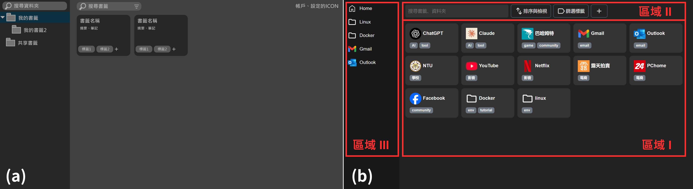
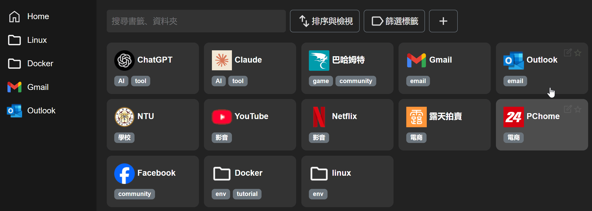
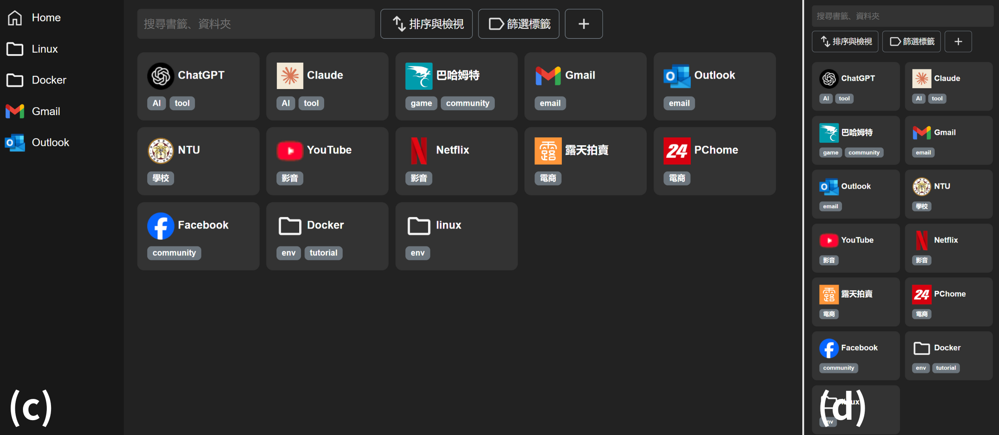

# 進度報告 - Team 15, Week 3

我們的專案主題與目標詳見： [README.md](../README.md)，其中包含專案簡介、預計實作的系統功能，以及時程規劃。

由於 Week 2-3 的課程主題為 **HTML 與 CSS**，本次作業我們聚焦於：

- 使用 HTML 與 CSS 打造易用、美觀且具擴展性的前端頁面。
- 為後續加入 JavaScript 與伺服器端功能奠定基礎。

## 課內技術練習



### 1. 網頁設計草稿

我們使用繪圖軟體進行初步設計，先定義網頁的主要輪廓與各區塊功能，作為後續實作的基礎（圖 a）。

### 2. HTML 與 CSS 實作

基於草稿內容，我們透過課堂所學 HTML 與 CSS 技術完成初版頁面（圖 b），以下為各區域功能的詳細說明：

- **區域 I：書籤陳列區**：

  - 此為網頁的主要呈現區塊。
  - 點擊書籤後，將透過 HTML 的 **`href` 屬性** 連結至已儲存的網頁。
  - 點擊資料夾後，預期將以 **[Expanding Grid](https://chriscoyier.net/2023/04/11/expanding-grid-cards-with-view-transitions/)** 的方式展開資料夾內內容。由於此功能涉及 JavaScript，因此安排於下次作業完成。

- **區域 II：功能區**

  - 此區域包含 **搜尋、排序與篩選、新增書籤** 三項功能。
  - 本次作業已完成上述功能的 UI 部分，後續將透過 JavaScript 實現互動功能：
    - 搜尋功能將使用 **[Select2](https://select2.org/)** 實作。
    - 排序與篩選、新增書籤功能則同樣以 Expanding Grid 的方式實現。
  - 由於這些互動功能依賴 JavaScript 生成元件，因此本次作業未提供展開後的細節畫面。

- **區域 III：側邊捷徑區**
  - 此處提供快速跳轉功能，點擊按鈕後跳轉至對應書籤資料夾。
  - 本次作業已完成 UI 設計，下次作業將透過 JavaScript 實作跳轉行為。

### 3. 使用者介面回饋設計

我們透過 CSS 及 Bootstrap CSS 樣式（參考後方「額外相關技術-2」），增進使用者互動時的回饋感。呈現如下方動畫。

- 書籤方塊 hover 時顯示編輯按鈕與顏色變化。
- 點擊按鈕或聚焦於搜尋框時呈現視覺回饋。
- 利用 cursor 提示使用者可進行的特定操作。



## 額外相關技術

### 1. Bootstrap - Responsive web design (RWD)

我們期望未來能做到跨裝置同步的功能，並讓網站良好的運行在手機、平板、電腦等不同裝置上。因此，我們採用 Bootstrap 框架，透過其提供的 **[Grid system](https://getbootstrap.com/docs/4.0/layout/grid/) 與 [Responsive classes](https://www.geeksforgeeks.org/responsive-utility-classes-in-bootstrap/)**，打造可 **自適應不同螢幕尺寸** 的網站。

舉例來說，在下方 HTML 中，我們使用 **`d-none` 與 `d-lg-block` 類別**，設定側邊欄（區域 III）僅於電腦上顯示，手機等較小螢幕裝置上則隱藏。

```html
<div class="sidebar d-none d-lg-block"></div>
```

又或者，我們透過 **Grid System**，分別設定不同裝置上搜尋欄的寬度，使其在手機上瀏覽時，仍能保持足夠大的顯示區域，確保良好的使用體驗。

```html
<div class="search-bar flex-shrink-0 col-12 col-md-5 col-lg-4"></div>
```

透過這種技術，我們的網站能適應不同大小的螢幕，例如 **電腦版介面（圖 c）**，以及 **手機版介面（圖 d）**。



### 2. CSS transitions 轉場效果

我們利用 CSS3 的 `transition` 屬性實現平滑的轉場效果，例如以下程式碼實現 hover 時浮現編輯按鈕的效果：

```css
.hidden-setting {
  opacity: 0;
  transition: opacity 0.1s;
}
.tag-card:hover > .hidden-setting {
  opacity: 1;
}
```

### 3. Bootstrap CSS 樣式、進階 CSS 樣式

我們基於 Bootstrap 內建 CSS 樣式，例如 `badge`、`bg-secondary`、`btn` 等類別，結合自定義的 CSS 屬性，打造符合專案風格的元件。同時，我們也研究及應用了一些課堂上沒有介紹的 CSS 屬性，例如 `crusor`，提升網站的視覺效果及使用體驗。

## 組員分工情形 - Team 15

- 王凱右 - 25%：HTML+CSS、Bootstrap
- 胡凱騰 - 25%：草稿、HTML+CSS
- 陳立亘 - 25%：撰寫報告
- 蔡佾家 - 25%：Bootstrap、收尾
