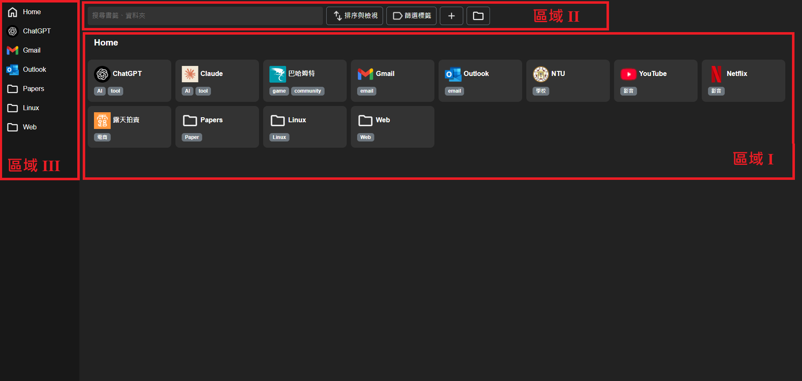
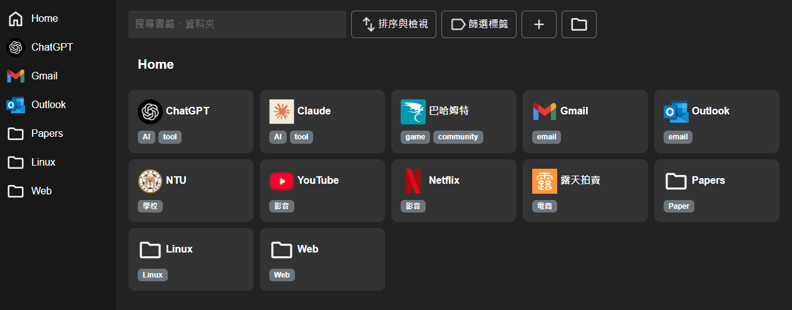
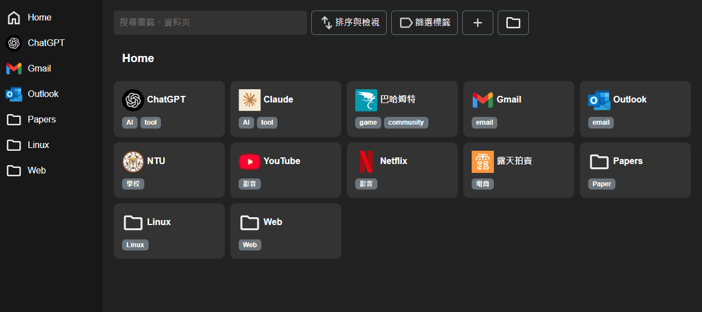

# 進度報告 - Team 15, Week 5

在本次作業中，我們以先前報告所展示的介面為基礎，**完全使用 React 重新建構專案**。同時，我們加入 JavaScript 完善各元件的功能，為後續加入伺服器端功能奠定基礎。

## 課內技術練習

此次我們透過建立 React component 並運用 JSX 語法，將整體網頁模組化。各 components 之間的階層結構如下所示。

使用者書籤的樹狀結構與相關資訊定義於 [class BookmarksTree](../frontend/src/context/BookmarksTree.js) 中，並透過 React Context 機制共享，這對應到下方結構中的 `BookmarksProvider`。更詳細的技術實作細節可參考後方的「額外相關技術」章節。

使用者的操作會透過事件註冊，觸發對應的 JavaScript function，進一步更新 React Context 中的變數，並啟動 React 的重新渲染流程，從而即時反映使用者的操作狀態。

```
App
└─ BookmarksProvider
    └─ Layout
        ├─ Sidebar
        │   ├─ HomeItem
        │   └─ SidebarItem (multiple)
        ├─ Navbar
        ├─ Breadcrumb
        │   ├─ RootItem
        │   └─ BreadcrumbItem (multiple)
        └─ MainContent
            └─ MainContentItem (multiple)
```

接下來將說明並展示此次所完成的功能。



### 區域 I：書籤陳列區

在此區中會展示使用者所建立的書籤與資料夾，使用 JaveScript object 儲存每筆資料，並抽象化引入資料的過程，為加入伺服器端功能奠定基礎。

當鼠標停滯於書籤或資料夾方塊時，右上方會顯示 **刪除書籤** 與 **加入捷徑** 的功能圖標，透過點擊圖標使用這兩個功能。

直接點擊方塊則會 **在新頁面中開啟該書籤**，若為資料夾，則此區會 **跳轉至資料夾內**，顯示該資料夾的內容。

因為使用者可以建立巢狀資料夾，所以在此區的最上方會顯示當前目錄，並可以 **透過點擊跳轉至指定目錄**。



### 區域 II：功能區

在功能區中主要提供三方面的功能，**新增書籤或資料夾**、**搜尋功能**、**篩選功能**。

在新增方面，不論書籤或資料夾都可以給予多個自訂的標籤，而新增的物件會被置於當前目錄下。在新增書籤時，會 **透過 Google API 抓取 favicon** 作為書籤圖標展示。



在搜尋方面，使用者可以 **透過搜尋列尋找指定名稱的書籤、資料夾或標籤**。

在篩選方面，「篩選標籤」按鈕則能透過選取的方式 **篩選要顯示的標籤**。


※「排序與檢視」功能尚未完善，故在本次作業中暫無展示。

### 區域 III：側邊捷徑區

在書籤陳列區中被加入捷徑的書籤與資料夾會放在此區中，**透過點擊能快速取用書籤，或快速跳轉至目標資料夾**，最上方的「home」可以讓使用者快速跳轉至根目錄。

## 額外相關技術

### 1. React Hooks - BookmarksContext

Context 是 React 提供的全域狀態管理工具，類似於全域變數。透過 context，我們可以 **在不同的 component 間共享資料**，而不需要透過 props 層層傳遞。

在本專案中，我們使用 context 管理書籤的樹狀結構 `BookmarksTree`，使各個元件都能方便的存取書籤資料，如下方程式碼：

```jsx
const BookmarksContext = createContext();

export function BookmarksProvider({ children }) {
  // ...
  return (
    <BookmarksContext.Provider
      value={{ bookmarksTree: bookmarksTreeRef.current }}
    >
      {children}
    </BookmarksContext.Provider>
  );
}
```

在 `BookmarksProvider` 中，我們使用 `useRef` 來儲存 `BookmarksTree` 的實例，如下方程式碼。

這麼做的主要原因，是為了 **避免每次 re-render 時都重新建立新的樹狀結構物件**。因為在 React 的 function component 中，所有在函式內宣告的變數（即使透過 `useState` 儲存）在每次 render 時都會被重新建立並賦值。而 `useRef` 則能讓我們維持同一個複雜的樹狀結構，避免不斷執行複雜的 constructor，進而提升效能。

```jsx
const bookmarksTreeRef = useRef(
  new BookmarksTree(treeStructure, idToBookmark, () => {
    forceUpdate((n) => n + 1);
  })
);
```

此外，我們也將一個 callback 傳入 `BookmarksTree`：

```jsx
forceUpdate((n) => n + 1);
```

這是一個小技巧，用來 **強制觸發 React 重新渲染畫面**。由於 `useRef` 的變化不會自動觸發畫面更新，因此當 `BookmarksTree` 的內容變動時，我們需要 **主動通知 React 更新畫面**，才能呈現最新的狀態。

這裡透過呼叫 `forceUpdate`，實際上是改變一個透過 useState 建立的值，藉此觸發整個元件的 re-render。這種作法讓我們能夠維持 `BookmarksTree` 的物件實例不變，同時在資料變動時即時更新 UI，確保顯示的內容與內部狀態保持一致。

### 2. Prettier

Prettier 是用於 **統一程式碼風格** 的工具，在開發過程中未統一的撰寫風格透過 Prettier 得以統合，例如下面的例子所示。

```jsx
// before
return (
  <>
    {starredBookmarks.map((item) => (
      <SidebarItem
        key={item.id}
        onToggleStar={handleToggleStar}
        onMoveToFolder={handleMoveToFolder}
      />
    ))}
  </>
);
```

```jsx
// after
return (
  <>
    {starredBookmarks.map((item) => (
      <SidebarItem
        key={item.id}
        onToggleStar={handleToggleStar}
        onMoveToFolder={handleMoveToFolder}
      />
    ))}
  </>
);
```

### 3. JaveScript - Vite and Proxy

透過 Vite 中的 `import.meta.glob` 可簡便的載入所需的資源，並確保在使用前載入完成。

Proxy 則為 JaveScript object 操作帶來更多彈性，能夠對鑑值進行更多判斷並決定對應操作。

## 組員分工情形 - Team 15

- 王凱右 - 25%：JaveScript、功能列設計
- 胡凱騰 - 25%：撰寫報告、bugfix
- 陳立亘 - 25%：JaveScript
- 蔡佾家 - 25%：JaveScript、整體架構
