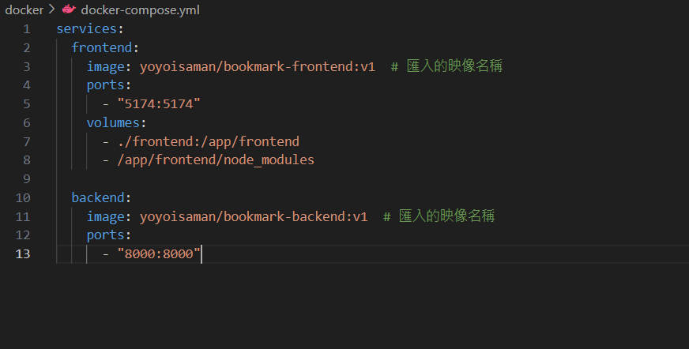

# 進度報告 - Team 15, Week 7
| 週次     | 主要進度 |
|---------|-------------|
| Week 2-3 | • 使用基本的 HTML 與 CSS 建構不具功能的前端頁面。<br>• 透過 `Bootstrap` 框架進行 Responsive Web Design (RWD)。 |
| Week 4-5 | • 完全使用 React 重新建構專案，模組化各個 component。<br>• 完成 **新增書籤/資料夾**、**刪除書籤**、**加入捷徑**、**搜尋功能**、**篩選功能**、**移動目錄（進入資料夾）** 多個功能。<br>• 建構 `BookmarksTree` 類別，以樹狀結構紀錄書籤資訊並提供操作功能。
| Week 6-7 | • 建構前端資料庫（IndexedDB）與後端資料庫（PostgreSQL），永久儲存用戶的書籤資料。<br>• 嘗試讓書籤可透過拖動排序。<br>• 打包成 Docker Image。 |

在這次作業中，我們將記錄標籤/資料夾結構的 `BookmarksTree` 儲存到前端資料庫 [IndexedDB](https://developer.mozilla.org/zh-TW/docs/Web/API/IndexedDB_API)，讓用戶在重啟瀏覽器後仍能保留內容。此外，我們也使用 Django 搭配 PostgreSQL 在後端儲存用戶書籤，為下週開發 **跨裝置同步** 功能做準備。

在 UI/UX 改進部分，我們嘗試基於 [Swapy](https://github.com/TahaSh/swapy)，讓書籤可以像手機 App 一樣透過拖曳改變順序。此功能目前已能在頁面上運作，但尚未與前後端資料庫串接，因此暫時位於 GitHub 的另一個 Branch：[draggable](https://github.com/yoyoisaman/Team15/tree/draggable)。


## 課內技術練習

本專案目前的整體架構如下圖（淺色文字代表尚未完成）。我們這週實作圖中右方橘色區塊的「前後端資料庫」，以下將分為講解 **前端資料庫（IndexedDB）** 與 **後端資料庫（PostgreSQL）** 兩大部分。


### 後端資料庫（PostgreSQL）

我們使用上課教的 Django 建立後端伺服器，並將用戶的書籤資料儲存於 PostgreSQL 資料庫中。

當用戶進入網頁，前端會向後端伺服器發送一個初始化請求，伺服器會根據用戶的 `token` 回傳相對應的書籤資料與最後修改時間（用以比對前端資料庫是否過舊）。這使得用戶得以跨裝置使用我們的網站，因為每次更動都會透過伺服器儲存，並同步到所有裝置上。

後端資料庫包含兩個表格，一個紀錄用戶的最後上傳時間，另一個則記錄用戶的書籤資料，格式如下：

| 欄位名稱    | 型別           | 說明               |
|-------------|----------------|--------------------|
| token       | VARCHAR(200)    | 用戶識別碼         |
| bid         | INTEGER         | 書籤的識別碼       |
| url         | VARCHAR(2000)   | 書籤網址           |
| name        | VARCHAR(200)    | 書籤名稱           |
| tags        | JSON            | 標籤 (列表格式)    |
| starred     | BOOLEAN         | 是否標記為最愛     |
| parent_id   | INTEGER         | 節點的 parent      |
| children_id | JSON            | 節點的 child       |

[Views.py](../backend/api/views.py) 會調用這個表格的資料，並轉換為對應 `BookmarksTree` 物件中變數 `treeStructure` 與 `bookmarks` 的格式，附加上最後修改時間後回傳給使用者。

### 前端資料庫（IndexedDB）

IndexedDB 是瀏覽器內建的本地端資料庫，它可以儲存的資料量比 localStorage 多非常多，而且支援索引，能夠快速查詢特定資料。由於 `BookmarksTree` 包含書籤的詳細資訊，資料量可能很大，因此我們採用 IndexedDB 在用戶本地端儲存書籤資訊。

在使用者進入網頁時，網頁會向後端請求書籤資料，並嘗試讀取 IndexedDB 中的 `treeStructure` 與 `bookmarks` 兩個表格。在比對最後修改時間後，較新的資料會被傳入 `BookmarksTree` 的 constructor 中，作為書籤的初始狀態。同時，如果 IndexedDB 的資料較舊，將會進行更新。

由於這週我們著重在建立 Django 伺服器與前後端溝通，此部分尚未最佳化。在課程進行到資料庫部分時，我們會將會會引入多用戶的帳號與 `token` 機制，由伺服器方主動驗證用戶端的資料是否過舊，從而節省回傳的流量與延遲。

## 額外相關技術

### PostgreSQL

Django 預設使用 SQLite 作為後端資料庫，然而，SQLite 作為輕量級資料庫，不允許多用戶寫入，因而限制了擴展性，對於多用戶應用並不是好選擇。

此外，從記錄用戶書籤資料的表格結構中我們可以看出，其需要由兩個欄位 `(token,bid)` 去組合 Composite Primary Key 才能保證唯一。但 SQLite 並不支援 Composite Primary Key 的使用。

基於上述兩個理由，我們採用能解決上述兩個問題且效率更高的 PostgreSQL 作為後端資料庫。為了便於測試，我們使用pgadmin4作為GUI，在 `docker-compose.yml` 中預設被註解，若有需要可以啟用。

### 拖動排序功能


## Docker Image Pull 連結及啟動方式

(1)安裝 docker

(2)測試 docker 是否安裝成功

打開終端機或命令提示字元，輸入以下指令檢查版本：

```bash
docker -v
```

(3)專案設定

從 GitHub 專案中取得 `docker-compose.yml` 之 docker 的設定檔

GitHub 專案結構如下：

```
TEAM15
├─ backend
├─ frontend
└─ docker
    └─ docker-compose.yml
```

在終端機中切換至該資料夾：

```bash
cd TEAM15/docker
```

(4)執行容器

當位於 `docker-compose.yml` 所在的資料夾時，執行以下指令啟動容器：

```bash
docker-compose up
```

這段指令目的是同時啟動一個前端容器跟一個後端容器，並把它們配置好指定的 port 跟資料夾，就會完成整個應用環境的部署。以下進行布署說明:



frontend :

-指定 frontend 容器使用 Docker Hub 上的映像檔 `yoyoisaman/bookmark-frontend:v1`
-主機的 `5174` port 對應容器內部的 `5174` port，這樣可透過 `localhost:5174` 訪問前端。

backend :

-指定 frontend 容器使用 Docker Hub 上的映像檔 `yoyoisaman/bookmark-backend:v1`
-主機的 `8000` port 對應容器內部的 `8000` port，可透過 `http://localhost:8000` 訪問後端 API。

## 組員分工情形 - Team 15

- 王凱右 - 25%：docker
- 胡凱騰 - 25%：前後段資料庫
- 陳立亘 - 25%：撰寫報告
- 蔡佾家 - 25%：前端(IndexedDB)