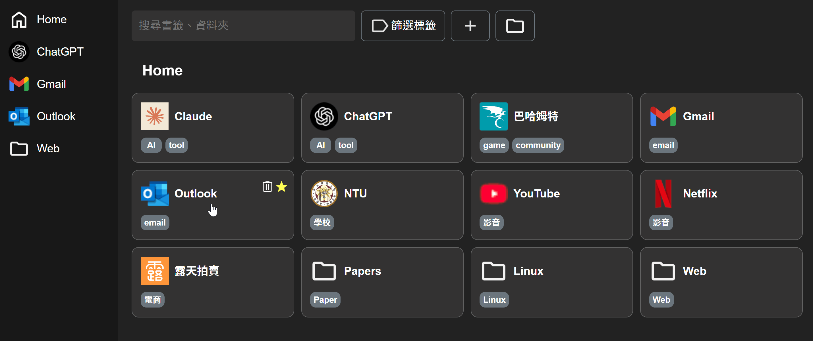

# 進度報告 - Team 15, Week 7

在這次作業中，我們將記錄標籤/資料夾結構的 `BookmarksTree` 儲存到前端資料庫 [IndexedDB](https://developer.mozilla.org/zh-TW/docs/Web/API/IndexedDB_API)，讓用戶在重啟瀏覽器後仍能保留內容。此外，我們也使用 Django 搭配 PostgreSQL 在後端儲存用戶書籤，為後續開發 **跨裝置同步** 功能做準備。

在 UI/UX 改進部分，我們嘗試基於 [Swapy](https://github.com/TahaSh/swapy)，讓書籤可以像手機 App 一樣透過拖曳改變順序。此功能目前已能在頁面上運作，但尚未與前後端資料庫串接，因此暫時放在 [GitHub branch](https://github.com/yoyoisaman/Team15/tree/draggable)。

## 課內技術練習

本專案目前的整體架構如下圖（淺色文字代表尚未完成）。我們這兩週實作了圖中橘色區塊的「前後端資料庫」，以下將分為 **前端資料庫（IndexedDB）** 與 **後端資料庫（PostgreSQL）** 兩大部分說明。


### 後端資料庫（PostgreSQL）

我們使用課堂所教的 Django 架設後端伺服器，並將用戶的書籤資料儲存於 PostgreSQL 資料庫中。

當用戶進入網頁時，前端會向後端伺服器發送初始化請求，伺服器根據用戶的 `token` 回傳對應的書籤資料與最後修改時間（用以比對前端資料庫是否過舊）。這讓用戶可以跨裝置使用網站，因為每次操作都會儲存到伺服器，並同步到所有裝置上。

後端資料庫包含兩個表格，一個紀錄用戶的最後上傳時間，另一個紀錄用戶的書籤資料，格式如下：

| 欄位名稱    | 型別          | 說明            |
| ----------- | ------------- | --------------- |
| token       | VARCHAR(200)  | 用戶識別碼      |
| bid         | INTEGER       | 書籤的識別碼    |
| url         | VARCHAR(2000) | 書籤網址        |
| name        | VARCHAR(200)  | 書籤名稱        |
| tags        | JSON          | 標籤 (列表格式) |
| starred     | BOOLEAN       | 是否標記為最愛  |
| parent_id   | INTEGER       | 節點的 parent   |
| children_id | JSON          | 節點的 child    |

[Views.py](../backend/api/views.py) 會調用這個表格的資料，並轉換為 `BookmarksTree` 物件中 `treeStructure` 與 `bookmarks` 的格式，附加最後修改時間後回傳給使用者。

### 前端資料庫（IndexedDB）

IndexedDB 是瀏覽器內建的本地端資料庫，可儲存比 localStorage 更多的資料，且支援索引功能，能快速查詢特定資料。由於 `BookmarksTree` 包含大量書籤資訊，因此我們採用 IndexedDB 在用戶本地端儲存書籤資料。

當使用者進入網頁時，前端會向後端請求書籤資料，並讀取 IndexedDB 中的 `treeStructure` 與 `bookmarks` 表格。在比對最後修改時間後，會將較新的資料傳入 `BookmarksTree` 的 constructor 中，作為書籤的初始狀態。如果 IndexedDB 中的資料較舊或不存在，系統也會自動更新。

由於本週重點在於建立 Django 伺服器與前後端溝通，此部分尚未進行最佳化。未來課程進行到資料庫部分後，我們將在伺服器端導入多用戶帳號與 `token` 機制，讓伺服器主動驗證前端資料是否過舊，進一步節省流量與降低延遲。

## 額外相關技術

### 1. PostgreSQL

Django 預設使用 SQLite 作為後端資料庫，但由於 SQLite 屬於輕量級資料庫，不支援多用戶同時寫入，擴展性有限，因此不適合多用戶應用。

PostgreSQL 除了支援多用戶寫入，還加強了對 JSON 資料型態的處理，因此我們選擇使用 PostgreSQL 取代 Django 預設的 SQLite 作為後端資料庫。為了方便測試，我們使用 [pgAdmin 4](https://www.pgadmin.org/) 作為 GUI 工具，並在 `docker-compose.yml` 中預設註解（關閉），如有需要可以自行啟用。

### 2. 拖曳排序功能

我們在另一個 [Branch](https://github.com/yoyoisaman/Team15/tree/draggable) 中，基於 [Swapy](https://github.com/TahaSh/swapy) 實作了拖曳排序功能，讓書籤可以像手機 App 一樣自由調整順序，如下圖所示。然而，由於此功能需要大幅重構現有程式碼，尚未來得及整合進 main branch，我們將於下次報告中說明完整邏輯。



## Docker Image Pull 連結及啟動方式

### 1. 安裝 docker

### 2. 測試 docker 是否安裝成功

打開終端機或命令提示字元，輸入以下指令檢查版本：

```bash
docker -v
```

### 3. 專案設定

從 GitHub 專案中取得 `docker-compose.yml` 之 docker 的設定檔。

GitHub 專案結構如下：

```
TEAM15
├─ backend
├─ frontend
└─ docker
    └─ docker-compose.yml
```

在終端機中切換至該資料夾：

```bash
cd TEAM15/docker
```

### 4. 執行容器

當位於 `docker-compose.yml` 所在的資料夾時，執行以下指令啟動容器：

```bash
docker-compose up
```

這段指令目的是同時啟動一個前端容器跟一個後端容器，並把它們配置好指定的 port 跟資料夾，就會完成整個應用環境的部署。以下進行布署說明:

```yaml
services:
  frontend:
    image: yoyoisaman/bookmark-frontend:v1 # 匯入的映像名稱
    ports:
      - "5174:5174"
    volumes:
      - ./frontend:/app/frontend
      - /app/frontend/node_modules

  backend:
    image: yoyoisaman/bookmark-backend:v1 # 匯入的映像名稱
    ports:
      - "8000:8000"

  postgres:
    image: postgres:16
    environment:
      POSTGRES_DB: bookmarks
      POSTGRES_USER: team15
      POSTGRES_PASSWORD: "16"
    ports:
      - "5432:5432"
    volumes:
      - ../postgres:/var/lib/postgresql/data # Persist database data


  # pgadmin:
  #   image: dpage/pgadmin4:9.2.0
  #   environment:
  #     PGADMIN_DEFAULT_EMAIL: admin@example.com
  #     PGADMIN_DEFAULT_PASSWORD: '16'
  #   ports:
  #     - '5050:80'
  #   depends_on:
  #     - postgres
  #   volumes:
  #     - ../pgadmin:/var/lib/pgadmin
```

#### frontend :

- 指定 frontend 容器使用 Docker Hub 上的映像檔 `yoyoisaman/bookmark-frontend:v1`
- 主機的 `5174` port 對應容器內部的 `5174` port，這樣可透過 `localhost:5174` 訪問前端。

#### backend :

- 指定 frontend 容器使用 Docker Hub 上的映像檔 `yoyoisaman/bookmark-backend:v1`
- 主機的 `8000` port 對應容器內部的 `8000` port，可透過 `http://localhost:8000` 訪問後端 API。

## 組員分工情形 - Team 15

- 王凱右 - 25%：docker
- 胡凱騰 - 25%：前後段資料庫
- 陳立亘 - 25%：撰寫報告
- 蔡佾家 - 25%：前端(IndexedDB)
