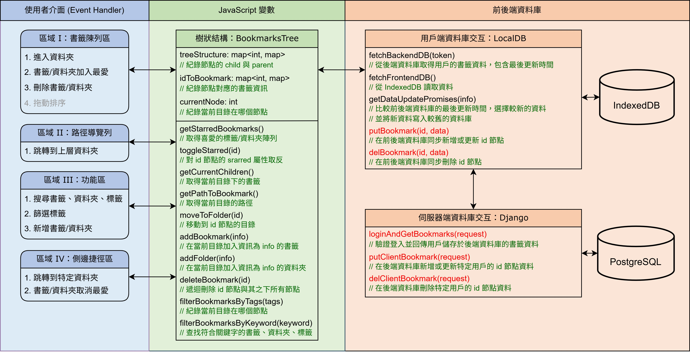
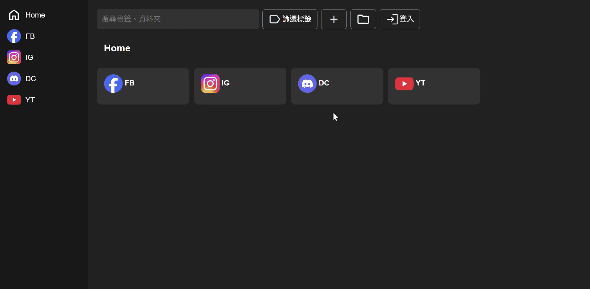

# 進度報告 - Team 15, Week 11

1.AJAX實作

在這次作業中，我們使用 `AJAX` 技術來實現前端與後端的非同步資料交換，利用 `jQuery` API 處理與後端 API 進行的所有資料交互。
配合本組書籤管理系統，實現資料庫進行非同步請求，並更新 UI 以便展示最新的書籤數據。

2.Django Login Page Template 與 MTV 架構

基於 Django 框架，實現了一個簡單的登入頁面。


## 課內技術練習

本專案目前的整體架構如下圖所示。這兩週我們實作了圖中以紅字標示的功能，主要包括：
1. 運用 **AJAX 技術**，將前端對書籤的操作即時同步至後端，為跨裝置同步功能做準備。
2. 利用 **URL 網址派發** 以及 **Template 技術**，優化 Django 後端的配置，提升系統的擴展性與可維護性。



### 1. URL 網址派發

```python
    path('login/', login_view, name='login'),
    path('api/get_csrf', get_csrf, name='get_csrf'),
    path('api/bookmarks/init', bookmarks_init_api, name='bookmarks_init_api'),
    path('api/bookmarks/update/<int:bid>', bookmarks_update_api, name='bookmarks_update_api'),
    path('api/bookmarks/delete/<int:bid>', bookmarks_delete_api, name='bookmarks_delete_api'),
```

我們根據上課講解的網址派發原則，設計並整理後端的 URL Routing，包含以下五項：

- `login/`：對應登入頁面。使用者登入成功後，網站會顯示用戶儲存於後端的書籤資料。此頁面由 **Template 技術** 完整產出 HTML。

- `api/get_csrf`：用於取得 CSRF token。

- `api/bookmarks/init`：當用戶載入網站時，會呼叫此 API 取得初始書籤資料。<br>（我們下週將在這裡引入 Session Cookie，記憶使用者的登入狀態，實現「重開瀏覽器仍保持登入」的功能，並透過此 API 回傳對應用戶的書籤資訊。）

- `api/bookmarks/update/<int:bid>`：當使用者新增或編輯書籤時，會透過 AJAX 呼叫此 API，同步更新後端資料。

- `api/bookmarks/update/<int:bid>`：當使用者刪除書籤時，同樣透過 AJAX 呼叫此 API，刪除對應的後端資料。

在更新與刪除書籤的 API 上，我們以資源導向為原則，利用 URL Parameter `<int:bid>` 指明需要編輯的書籤資源。

### 2. Template 實作

```html+django
<body>
    <div class="login-container">
        <h1>登入</h1>
        
            <p>{{ error }}</p>
        
        <form method="POST">
            
            <label for="username">Email</label>
            <input type="text" id="username" name="username" placeholder="您的 Email" required>
            ...
        </form>
    </div>
</body>
```


### 3. 使用 AJAX 與後端溝通


### 使用 AJAX 進行資料操作

`$.ajax()` 是 jQuery 提供的 AJAX 方法，他被用來進行資料請求，具有多種函式式的選項和配置，例如 xhrFields、success、error 等處理函式，這些功能可以讓開發者處理 HTTP 請求和回應的各種狀況，並且在此次作業實作中均有使用。


1.初始化 CSRF Token

為了防止跨站請求偽造 (CSRF)，首先向後端請求 CSRF Token 並將其存儲，後續的 AJAX 請求將會附帶此 token。

這段程式碼通過向後端發送 GET 請求來獲取 CSRF Token，並將其保存在 `csrfToken` 變數中:

```javascript
await $.ajax({
    url: 'http://localhost:8000/api/get_csrf',
    type: 'GET',
    contentType: 'application/json',
    xhrFields: {
        withCredentials: true  // 包含 cookie 資訊
    },
    success: function (data) {
        csrfToken = Cookie.get('csrftoken');  // 儲存 CSRF Token
    },
    error: function (xhr, status, error) {
        console.error('Error:', error);
    }
});
```


2.初始化書籤資料

當用戶首次載入頁面時，會通過 AJAX 向伺服器發送 POST 請求來初始化書籤資料。這些資料會儲存於本地的 `IndexedDB` 中。
在向後端發送 POST 請求後，獲取書籤資料並儲存到本地資料庫中:

```javascript
await $.ajax({
    url: 'http://localhost:8000/api/bookmarks/init',
    type: 'POST',
    contentType: 'application/json',
    success: function (data) {
        databaseStatus = data.databaseStatus;
        treeStructure = data.treeStructure;
        idToBookmark = data.idToBookmark;
    },
    error: function (xhr, status, error) {
        console.error('Error:', error);
    }
});
```

3.更新書籤資料

在更新書籤或資料夾時，會將更新資料發送到伺服器，並更新本地資料庫的書籤資料。

```javascript
$.ajax({
    url: 'http://localhost:8000/api/bookmarks/update/' + id,
    type: 'POST',
    contentType: 'application/json',
    data: JSON.stringify({
        time: updateTime,
        parent_id: data.parent_id,
        children_id: data.children_id,
    }),
    success: function (data) {
        console.log("Server update success:", data);
    },
    error: function (xhr, status, error) {
        console.error('Server update error:', error);
    }
});
```


4.刪除書籤資料

當用戶刪除書籤或資料夾時，使用 AJAX 發送刪除請求，並更新本地資料庫以反映變更。

```javascript
$.ajax({
    url: 'http://localhost:8000/api/bookmarks/delete/' + id,
    type: 'POST',
    contentType: 'application/json',
    data: JSON.stringify({
        time: updateTime,
    }),
    success: function (data) {
        console.log("Server delete success:", data);
    },
    error: function (xhr, status, error) {
        console.error('Server delete error:', error);
    }
});
```


### MTV架構與Template實作

MTV檔案示意圖如下

```bash
backend/
├── templates/
│   └── login.html  # 登入頁面模板
├── api/
│   └── views.py    # 處理登入頁面的視圖邏輯
└── urls.py         # URL 路徑配置
```


1.使用者登錄 ( Template )

當用戶選擇登錄帳戶時會進入到使用者登錄畫面

在這裡，我們要求使用者以 e-mail 作為帳號，接著再輸入密碼，並且亦有提供忘記密碼的選項。登錄模板實作範例其內容如下：




2.登錄邏輯、 url 配置

登入邏輯在 `views.py` 中實現，為了處理用戶的請求並返回適當的回應， `login_view` 的函式會處理登入頁面的顯示和表單提交。當用戶提交登入表單時，會檢查提供的用戶名和密碼是否正確。如果不正確，會重新渲染 login.html 並顯示錯誤訊息。

為了配置 url ，在 `urls.py` 中設置路徑 /login 指向 login_view，這樣當用戶訪問 /login 時， Django 會調用該視圖處理登入頁面的渲染。程式範例如下:

```python
from api.views import login_view

urlpatterns = [
    path('login/', login_view, name='login'),
]
```


## 額外相關技術

這次課外的部分，我們為了預防應用程式遭受 SQL Injection 和 XSS 攻擊。以下是這次採用的相關防護措施保以及實際操作說明。

### 1. SQL Injection 防護

SQL Injection 是一種通過注入惡意 SQL 語句來攻擊資料庫的手段。配合這次的實作，我們使用 Django 提供的 ORM 來進行資料庫查詢。Django ORM 會自動處理 SQL 語句的生成，並且避免了直接寫入原生 SQL，從而有效防止了 SQL Injection 攻擊。例如：

```python
bookmark = Bookmarks.objects.filter(account=user.account, bid=bid)
```

這種方式會自動對輸入進行處理，避免了直接拼接 SQL 字串，Django ORM 自動參數化查詢，能有效防止 SQL Injection 攻擊。

### 2.XSS 攻擊

除了 SQL Injection 以外，也考慮到了 XSS 攻擊。為避免攻擊者將惡意的 JavaScript 程式碼注入到網站中，並且利用用戶瀏覽器執行。以下是我們的防護措施：

1.字串消毒處理

對所有來自用戶的輸入進行字串消毒，以確保特殊字符被轉義，並移除可能執行 JavaScript 的元素。

2.資料結構的消毒處理

除了處理單一字串外，我們也會遞迴地處理整個資料結構（如字典或列表），以確保其中的所有字串都經過清洗。這樣不僅能處理單一字串，還能處理包含字串的複雜資料結構，從而有效防止 XSS 攻擊。

```python
def sanitize_data(data):

    if isinstance(data, str):
        return sanitize_string(data)
    elif isinstance(data, list):
        return [sanitize_data(item) for item in data]
    elif isinstance(data, dict):
        return {k: sanitize_data(v) for k, v in data.items()}
    else:
        return data
```

### 3.驗證輸入資料

為了確保從用戶端接收到的資料是有效且安全的，我們對用戶提交的資料進行嚴格的驗證。在這部分，除了檢查資料的類型和長度限制外，我們也會確保所有必須的欄位都已經填寫並且資料格式正確。

```python
def validate_bookmark_request(data, require_all_fields=False):
    required_fields = {
        'time': str,
        'parent_id': int,
        'children_id': list,
        'url': str,
        'img': str,
        'name': str,
        'tags': list,
        'starred': bool,
        'hidden': bool
    }
```
這樣可以確保所有提交的資料符合預期格式，並有效防止錯誤資料的注入。


## 組員分工情形 - Team 15

- 王凱右 - 25%：額外技術實作
- 胡凱騰 - 25%：上課作業實作
- 陳立亘 - 25%：撰寫報告
- 蔡佾家 - 25%：撰寫報告
