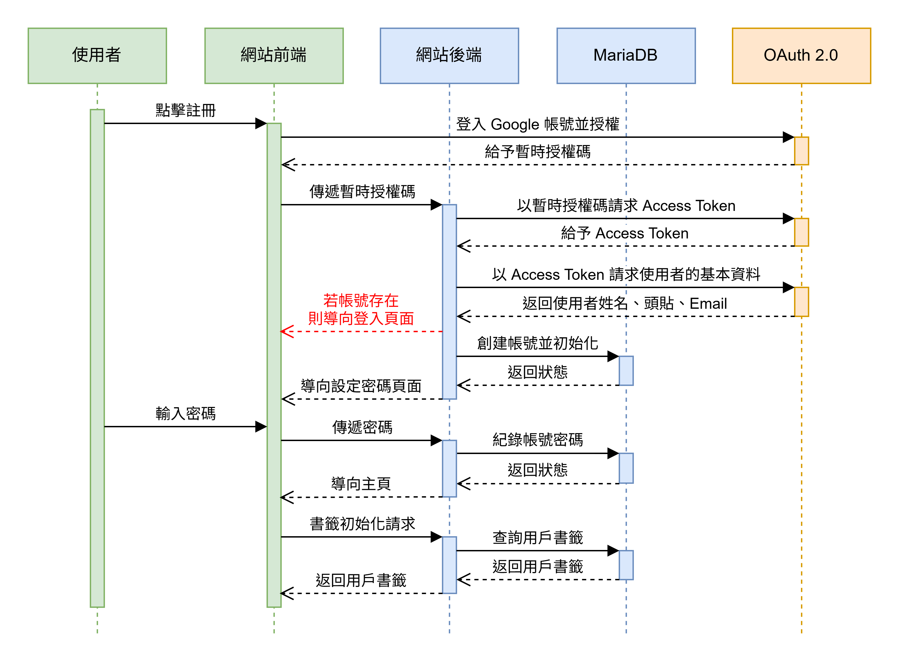
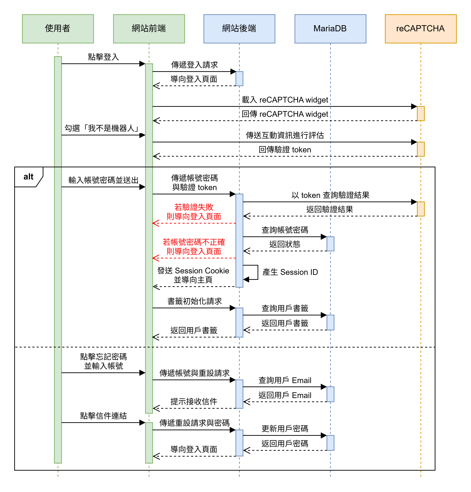
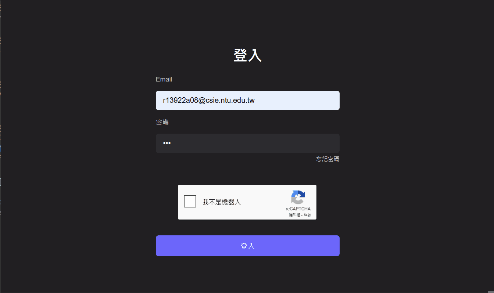
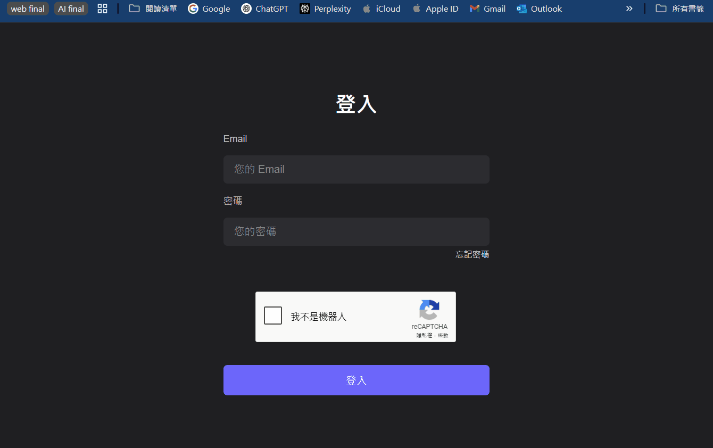
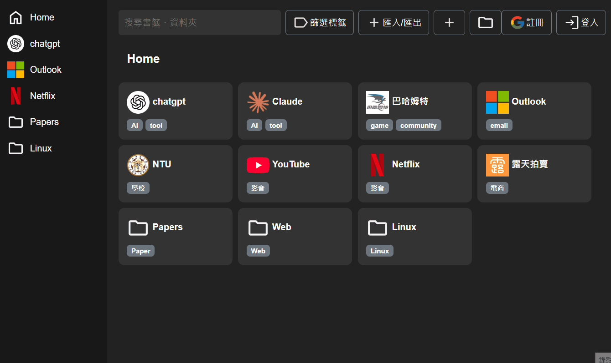
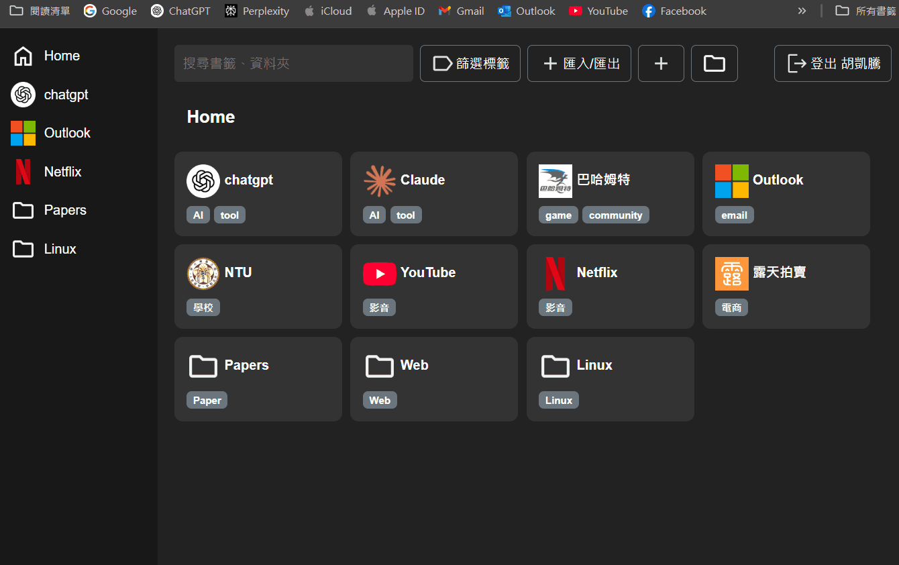
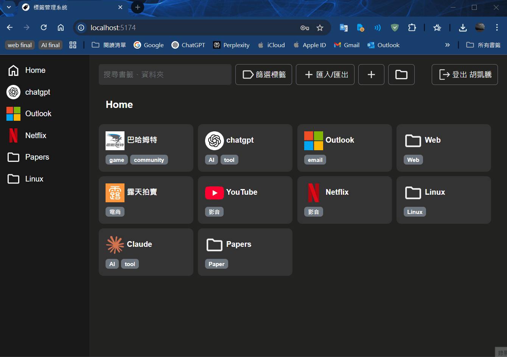

# 進度報告 - Team 15, Week 11

在本次作業中，我們整合課程中所學的多項技術，實作出具備完整帳號系統的書籤管理平台。

使用者可 **透過 Google 帳號註冊** 建立個人帳號，系統同時支援 **自動保持登入狀態**、**忘記密碼（透過電子郵件重設）**、以及 **書籤匯入與匯出** 等功能，提供便利且安全的使用體驗。

此外，我們也完成 **跨裝置同步** 功能，讓使用者能隨時隨地存取與管理個人書籤內容。

## 課內技術練習

### 1. 註冊與登入功能

以下為 **使用 Google 帳號註冊** 與 **登入 / 忘記密碼（透過電子郵件重設）** 功能的時序圖。各項功能中所運用的技術將於後方詳細說明：

- **以 Google 帳號註冊**：結合 **OAuth 2.0**、**POST/GET**、**Session**、**Cookie** 等技術實現。



- **登入與忘記密碼**：使用 **reCAPTCHA**、**Email 發送**、**POST/GET**、**Session**、**Cookie** 技術。



### 2. URL 網址派發

在前次作業中，我們已透過 Django 的 `urls.py` 建立登入頁面對應的 URL。本次作業進一步擴充註冊、登出與密碼重設等功能，並延續使用 Template 技術、繼承 `base.html` 產出相關頁面。

以下為新增的 URL 及其對應的後端處理函式：

```python
path('login/', login_view, name='login'),
path('logout/', logout_view, name='logout'),
path('oauth2callback/', oauth2callback, name='oauth2callback'),
path('password/', set_password, name='password'),
path('forgot-password/', forgot_password, name='forgot_password'),
path('reset-password/<str:token>/', reset_password, name='reset_password'),
```

- `logout/`：以 API 方式通知後端清除使用者的 Session，完成登出操作。

- `oauth2callback/`：處理 Google OAuth 2.0 授權完成後的註冊邏輯，詳見 **額外相關技術：Google OAuth 2.0**。

- `password/`：使用者首次註冊後進行密碼設定的頁面，使用 Django Template 產生 HTML。

- `forgot-password/`：密碼重設請求頁面，系統會寄送重設連結至註冊信箱，頁面以 Template 呈現。

- `reset-password/<str:token>/`：密碼重設頁面，透過網址中的 token 識別目標帳號，頁面亦由 Template 產生。

### 3. Session、Cookie 與 POST/GET

Session 提供後端辨識使用者身分的能力。當使用者完成註冊或登入成功後，後端會建立 Session 並將 Session ID 以 **HTTP Cookie** 的形式傳送至前端，由瀏覽器儲存。

為了提升安全性，我們使用了 Django 預設的 Session Cookie 設定，並啟用 **HttpOnly** 屬性，確保該 Cookie 無法被 JavaScript 存取，避免 Session ID 遭受 XSS 攻擊而洩漏。

此後，使用者發出的每一個請求都會自動附帶該 Session ID，後端即可根據此 ID 作為 key，查詢與該使用者相關的資訊，如姓名、Email、頭像等，如下方程式碼：

```python
request.session['name'] = name
request.session['username'] = email
request.session['picture'] = picture
request.session['is_authenticated'] = False
request.session.set_expiry(60 * 60 * 24 * 7) # Session 期限設為 7 天，保持長久登入
```

為了實現「長久登入」，我們透過以下兩項設定來延長 Session 的有效期限：

1. 在後端使用 `request.session.set_expiry(60 * 60 * 24 * 7)`，將 Session 設定為 7 天後過期。

2. 在 `settings.py` 中設定 `SESSION_EXPIRE_AT_BROWSER_CLOSE = False`，使 Session 不會關閉瀏覽器就失效。

由於 Session ID 是透過 **瀏覽器儲存的 Cookie** 傳遞。只要該 Cookie 尚未過期，瀏覽器在重新整理頁面或關閉並重新開啟後，仍會自動附帶該 Cookie，因此使用者無需重新登入，即可維持登入狀態，從而達到「長久登入」的效果。

### 4. API 串接與防機器人驗證（reCAPTCHA）

本專案串接數個外部 API，分別對應不同功能需求，說明如下：

- `https://www.google.com/s2/favicons?domain=${domain}`：用於取得網站的小圖示（favicon），並顯示於書籤列表中。

- `https://oauth2.googleapis.com/token`：對應註冊時序圖中「以暫時授權碼換取 Access Token」的步驟，為 Google OAuth 2.0 驗證流程的一環，詳見 **額外相關技術** 章節。

- `https://openidconnect.googleapis.com/v1/userinfo`：用於取得使用者的 Google 帳號資訊（如名稱與頭像），以便於前端顯示登入使用者身分。

- `https://www.google.com/recaptcha/api/siteverify`：搭配 Google reCAPTCHA 使用，當使用者於登入頁面完成驗證後，前端會取得一組 token，後端再透過此 API 查詢該 token 是否有效，以防止自動化機器登入攻擊。

以下動畫展示登入流程與驗證畫面：



### 5. Email 發送

當使用者申請重設密碼時，後端會隨機產生一組 token 並儲存，接著將該 token 結合至 `reset-password/<str:token>/` 的網址中，作為重設密碼頁面的唯一識別連結。系統會自動將這個連結寄送至使用者註冊時填寫的 Google 信箱，使用者點擊後即可導向至對應的重設密碼頁面。

我們使用 Gmail 的 SMTP 伺服器來發送這封重設密碼信，並透過 Django 的 `django.core.mail` 模組來設定寄件帳號、撰寫信件內容並完成寄送。



## 額外相關技術

### 1. Google OAuth 2.0 - 註冊帳號

本系統要求使用者以 Google 帳號註冊，並透過 Google 所提供的授權機制 **OAuth 2.0** 來完成身分驗證與資訊取得。



如註冊時序圖所示，使用者點擊註冊後，首先會被導向 Google 的登入授權頁面 `https://accounts.google.com/o/oauth2/v2/auth`。登入成功後，Google 會將使用者重新導向回我們系統的 `oauth2callback/`，並透過 GET 參數附上 **暫時授權碼（authorization code）**。

後端收到授權碼後，會呼叫 `https://oauth2.googleapis.com/token` API 交換取得 Access Token，再進一步透過 `https://openidconnect.googleapis.com/v1/userinfo` API 取得使用者的 Google 帳號資訊。

取得必要資訊並完成帳號初始化後，系統便會將使用者導向至 `password/` 頁面，進行密碼設定以完成整個註冊流程。

### 2. 匯入/匯出書籤

為了方便使用者備份或分享自己的書籤庫，我們設計了書籤的匯出與匯入功能。



**匯出功能** 會將書籤資料轉換為符合 JSON 格式的字串，並透過 Blob（Binary Large Object）封裝成 JSON 檔案。接著使用 `URL.createObjectURL(blob)` 建立可供下載的連結，讓使用者將書籤儲存至本地。匯出完成後，系統會呼叫 `URL.revokeObjectURL(url)` 釋放記憶體資源。程式碼如下：

```javascript
const handleExport = () => {
    const data = {
        treeStructure: bookmarksTree.treeStructure,
        idToBookmark: bookmarksTree.idToBookmark,
    };
    const blob = new Blob([JSON.stringify(data, null, 2)], { type: "application/json" });
    const url = URL.createObjectURL(blob);
    const a = document.createElement("a");
    a.href = url;
    a.download = "bookmarks_export.json";
    a.click();
    URL.revokeObjectURL(url);
};
```

匯入功能則是透過 JavaScript 的 `FileReader` 物件讀取使用者所上傳的 `.json` 檔案內容。若讀入內容能成功解析為 JSON，且其結構符合書籤格式，系統便會以該資料覆蓋前後端所儲存的書籤庫內容。程式碼如下：

```javascript
const handleImport = (e) => {
    const file = e.target.files[0];
    if (!file) return;
    const reader = new FileReader();
    reader.onload = (evt) => {
        const data = JSON.parse(evt.target.result);
        if (data.treeStructure && data.idToBookmark) {
            bookmarksTree.buildNewTree(data.treeStructure, data.idToBookmark);
            onClose();
        } else {
            alert("檔案格式錯誤！");
        }
    };
    reader.readAsText(file);
};
```

這些功能皆透過 React component [BookmarkImportExportModal](../frontend/src/components/BookmarkImportExportModal/BookmarkImportExportModal.jsx) 實作，程式碼可參考連結。

### 3. 跨裝置同步

我們透過 Session 辨識使用者身分，使系統能在不同裝置上判斷相同帳號，並同步該使用者的書籤資料。只要使用者使用相同 Google 帳號登入，系統便會載入其個人書籤庫，使操作無縫接軌、不中斷。



### 4. 快捷鍵啟動功能

為方便使用者快速操作此書籤專案，新增快捷鍵啟動各項功能之設定。

實際作法分別朝兩個方向(a. 開啟書籤或資料夾 b. 開啟書籤功能)進行操作

a. ctrl + 數字 1 ~ 9 : 開啟書籤或資料夾

```javascript
if (e.ctrlKey && e.key >= '1' && e.key <= '9') {
        e.preventDefault();  // 防止瀏覽器的預設行為
        
        const idx = parseInt(e.key, 10) - 1;
        const visible = bookmarksTree.getCurrentChildren().filter(b => !b.hidden);
        if (idx < visible.length) {
          const item = visible[idx];
          if (item.url === "#") {
            bookmarksTree.moveToFolder(item.id);
          } else {
            window.open(item.url, "_blank");
          }
        }
      }
```

這段程式碼透過檢查 `item.url` 的值判斷是書籤還是資料夾。

如果 `item.url === "#"`, 那麼該項目被視為資料夾，表示它不是一個具體的 URL，而是用來指向一個資料夾或資料夾的路徑，並且會呼叫 `bookmarksTree.moveToFolder(item.id)` 來移動到該資料夾。

如果 `item.url 不是 "#"`，則該項目被視為書籤，會有有效的 URL，通常是一個網頁地址，並且會透過 `window.open(item.url, "_blank")` 來打開該書籤的 URL。

b. 開啟書籤功能

本次共設計以下四種快捷鍵提供使用

ctrl + b : 打開新增書籤視窗

ctrl + f : 打開新增資料夾視窗

ctrl + / : 聚焦搜尋欄

ctrl + i : 打開匯入匯出


以下我們以 `ctrl + f` (打開新增資料夾視窗) 來舉例:

```javascript
if (e.ctrlKey && e.key === 'f') { // 當 Ctrl + F 被按下
    e.preventDefault();  // 防止瀏覽器的預設行為
    const addFolderButton = document.querySelector('[data-add-folder-button]'); // 在Navbar中設定一個data屬性來識別按鈕
    if (addFolderButton) {
          addFolderButton.click();  // 模擬點擊新增資料夾按鈕
    }
}
```

使用快捷鍵執行功能的方式，是在其執行動作的 button 內設定屬性來識別按鈕。比如說 `ctrl + f (打開新增資料夾視窗)` 就是找到其存在的 button 內，新增 `data-add-folder-button` 此屬性，讓快捷鍵能夠找到其實際運作的方式，並且能夠模擬點擊資料夾按鈕。

```javascript
<button
    className="btn btn-outline-secondary d-flex align-items-center"
    onClick={handleAddFolderButtonClick}
    data-add-folder-button // 新增此屬性 讓 HotkeyHandler 辨識此按鈕
>
```

無論是 a 或 b ，當我們設定的 ctrl 加上其對應的按鍵，該功能就會執行。且為了預防該快捷鍵與瀏覽器原先就存在的快捷鍵有衝突，設置 `preventDefault` 以預防快捷鍵衝突；當衝突發生時，只會執行我們所設置的快捷鍵，而瀏覽器內建的快捷鍵則不會操作。


## 組員分工情形 - Team 15

- 王凱右 - 25%：部分課內及額外技術
- 胡凱騰 - 25%：撰寫報告
- 陳立亘 - 25%：額外技術
- 蔡佾家 - 25%：登入相關內容

## Docker Image Pull 連結及啟動方式

### 1. 下載.env

請先下載 [.env](https://drive.google.com/file/d/1493aD3bxC27gI3fc32HPnkBCwMdKmL89/view?usp=drive_link)，並放置於 Team15 的根目錄 :

```
TEAM15
├─ backend
├─ frontend
├─ docker
├─ HW_Report
├─ ...
└─ .env <=== 將下載的 .env 檔案放置於此 
```

### 2. 安裝 Docker

### 3. 測試 Docker 是否安裝成功

打開終端機或命令提示字元，輸入以下指令檢查版本：

```bash
docker -v
```

### 4. 專案設定

從 GitHub 專案中取得 `docker-compose.yml` 的 Docker 的設定檔。

GitHub 專案結構如下：

```
TEAM15
├─ backend
├─ frontend
└─ docker
    └─ docker-compose.yml
```

### 5. 移動至指定目錄

在終端機中切換至 `docker` 資料夾：

```bash
cd TEAM15/docker
```

### 6. 執行容器

當位於 `docker-compose.yml` 所在的資料夾時，執行以下指令啟動容器：

```bash
docker-compose -f ./docker-compose.yml up
```

### 7. 訪問網站

- 可透過 `localhost:5174` 訪問前端。

- 可透過 `localhost:8000` 訪問後端 API。

- 可透過 `localhost:8080` 訪問後端資料庫。
