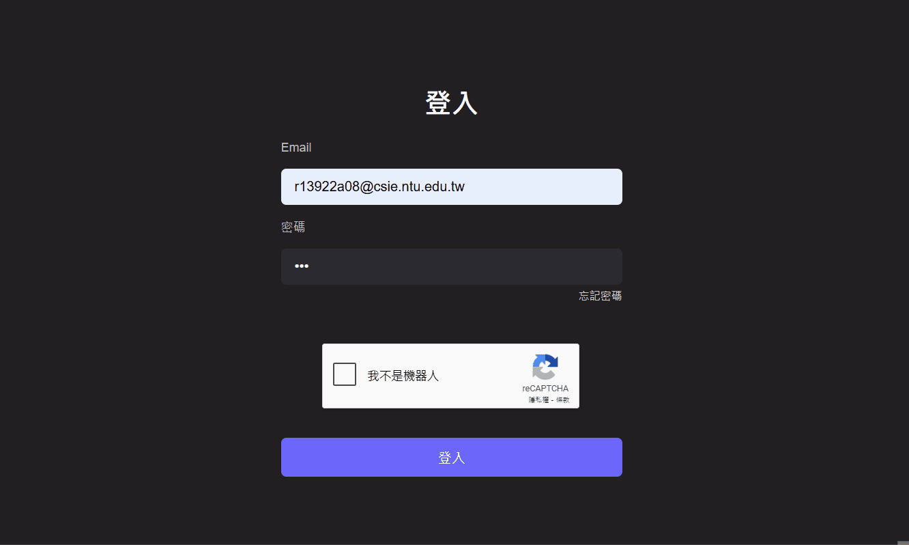

# 進度報告 - Team 15, Week 11

在本次作業中，我們整合課程中所學的多項技術，實作出具備完整帳號系統的書籤管理平台。

使用者可 **透過 Google 帳號註冊** 建立個人帳號，系統同時支援 **自動保持登入狀態**、**忘記密碼（透過電子郵件重設）**、以及 **書籤匯入與匯出** 等功能，提供便利且安全的使用體驗。

此外，我們也完成 **跨裝置同步** 功能，讓使用者能隨時隨地存取與管理個人書籤內容。

## 課內技術練習

### 1. 註冊與登入功能

以下為 **使用 Google 帳號註冊** 與 **登入 / 忘記密碼（透過電子郵件重設）** 功能的時序圖。各項功能中所運用的技術將於後方詳細說明：

- **以 Google 帳號註冊**：結合 **OAuth 2.0**、**POST/GET**、**Session**、**Cookie** 等技術實現。


- **登入與忘記密碼**：使用 **reCAPTCHA**、**Email 發送**、**POST/GET**、**Session**、**Cookie** 技術。


### 2. URL 網址派發

在前次作業中，我們已透過 Django 的 `urls.py` 建立登入頁面對應的 URL。本次作業進一步擴充註冊、登出與密碼重設等功能，並延續使用 Template 技術、繼承 `base.html` 產出相關頁面。

以下為新增的 URL 及其對應的後端處理函式：

```python
path('login/', login_view, name='login'),
path('logout/', logout_view, name='logout'),
path('oauth2callback/', oauth2callback, name='oauth2callback'),
path('password/', set_password, name='password'),
path('forgot-password/', forgot_password, name='forgot_password'),
path('reset-password/<str:token>/', reset_password, name='reset_password'),
```

- `logout/`：以 API 方式通知後端清除使用者的 Session，完成登出操作。

- `oauth2callback/`：處理 Google OAuth 2.0 授權完成後的註冊邏輯，詳見 **額外相關技術：Google OAuth 2.0**。

- `password/`：使用者首次註冊後進行密碼設定的頁面，使用 Django Template 產生 HTML。

- `forgot-password/`：密碼重設請求頁面，系統會寄送重設連結至註冊信箱，頁面以 Template 呈現。

- `reset-password/<str:token>/`：密碼重設頁面，透過網址中的 token 識別目標帳號，頁面亦由 Template 產生。

### 3. Session & POST/GET

Session 提供後端辨識使用者身分的能力。當使用者完成註冊或登入成功後，後端會建立 Session 並將 Session ID 以 **HTTP Cookie** 的形式傳送至前端，由瀏覽器儲存。

為了提升安全性，我們使用了 Django 預設的 Session Cookie 設定，並啟用 **HttpOnly** 屬性，確保該 Cookie 無法被 JavaScript 存取，避免 Session ID 遭受 XSS 攻擊而洩漏。

此後，使用者發出的每一個請求都會自動附帶該 Session ID，後端即可根據此 ID 作為 key，查詢與該使用者相關的資訊，如姓名、Email、頭像等，如下方程式碼：

```python
request.session['name'] = name
request.session['username'] = email
request.session['picture'] = picture
request.session['is_authenticated'] = False
request.session.set_expiry(60 * 60 * 24 * 7) # Session 期限設為 7 天，保持長久登入
```

為了實現「長久登入」，我們透過以下兩項設定來延長 Session 的有效期限：

1. 在後端使用 `request.session.set_expiry(60 * 60 * 24 * 7)`，將 Session 設定為 7 天後過期。

2. 在 `settings.py` 中設定 `SESSION_EXPIRE_AT_BROWSER_CLOSE = False`，使 Session 不會關閉瀏覽器就失效。

由於 Session ID 是透過 **瀏覽器儲存的 Cookie** 傳遞。只要該 Cookie 尚未過期，瀏覽器在重新整理頁面或關閉並重新開啟後，仍會自動附帶該 Cookie，因此使用者無需重新登入，即可維持登入狀態，從而達到「長久登入」的效果。

### 4. API 串接 & 防機器人驗證（reCAPTCHA）

我們在此專案中使用到了數個 API，如下所列:

- `https://www.google.com/s2/favicons?domain=${domain}` : 獲取網站分頁的小圖標。

- `https://oauth2.googleapis.com/token` : 註冊時序圖中「以暫時授權碼換取 Access Token」步驟所對應的 API，詳細說明請參照 **額外相關技術**。

- `https://openidconnect.googleapis.com/v1/userinfo` : 用於獲取使用者 Google 帳號的資訊，包含名稱與頭像，這些資訊用於前端顯示當前登入的帳號。

- `https://www.google.com/recaptcha/api/siteverify` : 登入時序圖中提供 reCAPTCHA 驗證的 API，於登入頁面中使用，當使用者於前端完成驗證後會取得一個封存驗證資訊的 Token，而後端在接收到該 Token 後會用於此 API 以查詢該驗證是否成功。



### 5. Email 發送

當使用者要求重設密碼時，後端會以隨機方式產生並儲存一個 Token，將該 Token 與 `reset-password/<str:token>/` 結合才能導向重設該帳號密碼的頁面，為此我們會將導向此頁面的連結寄送到使用者的信箱。

我們透過 Gmail 的 SMTP 伺服器發送 Email，並於後端使用 Django 的 `django.core.mail` 模組來設定相關參數並完成寄送。


## 額外相關技術

### 1. Google OAuth 2.0 - 註冊帳號

此次註冊系統要求使用者以 Google 帳號註冊，而 Google 提供帳號授權的機制便是 **Google OAuth2.0**。


如註冊時序圖所示，一開始會先跳轉至 Google 所提供的登入頁面 `https://accounts.google.com/o/oauth2/v2/auth`，登入成功後會重新導向至先前 URL 網址派發的 `oauth2callback/`，同時也會將暫時授權碼以 GET 的方式傳遞給重新導向的網址。

接著後端再使用暫時授權碼與 `https://oauth2.googleapis.com/token` 交換 Access Token，所取得的 Access Token 讓我們能從 `https://openidconnect.googleapis.com/v1/userinfo` API 中獲取該 Google 帳號的資訊。當從 API 獲取完所需資訊及帳號創建的初始化過程結束後，會再重新導向至 URL 網址派發的 `password/` 讓使用者設定密碼。

### 2. 匯出匯入書籤

為了使用者便於備份與分享其書籤庫，我們提供匯出匯入書籤的功能。匯出時會先將書籤庫資料轉換為符合 JSON 格式的字串，接著透過 Blob (Binary Large Object) 封裝為 JSON 檔案形式，並以 `URL.createObjectURL(blob)` 建立該 Blob 的下載連結，以此匯出書籤庫，匯出完成後再以 `URL.revokeObjectURL(url)` 釋放占用的記憶體資源。
```javascript
const handleExport = () => {
    const data = {
        treeStructure: bookmarksTree.treeStructure,
        idToBookmark: bookmarksTree.idToBookmark,
    };
    const blob = new Blob([JSON.stringify(data, null, 2)], { type: "application/json" });
    const url = URL.createObjectURL(blob);
    const a = document.createElement("a");
    a.href = url;
    a.download = "bookmarks_export.json";
    a.click();
    URL.revokeObjectURL(url);
};
```

匯入書籤庫資料時則透過 Javascript FileReader 物件以文字形式讀入 `<input type="file">` 輸入的檔案，並嘗試將其解析為 JSON 物件，如果解析成功並符合書籤庫的格式，則將讀入的資訊覆蓋前後端資料庫儲存的書籤庫。
```javascript
const handleImport = (e) => {
    const file = e.target.files[0];
    if (!file) return;
    const reader = new FileReader();
    reader.onload = (evt) => {
        const data = JSON.parse(evt.target.result);
        if (data.treeStructure && data.idToBookmark) {
            bookmarksTree.buildNewTree(data.treeStructure, data.idToBookmark);
            onClose();
        } else {
            alert("檔案格式錯誤！");
        }
    };
    reader.readAsText(file);
};
```

這些功能透過 React component 的方式建立操作頁面，並加入先前的主頁中，詳細內容可參考 `frontend\src\components\BookmarkImportExportModal\BookmarkImportExportModal.jsx`


### 3. 跨裝置同步

透過 Session，我們得以判斷不同使用者帳號，並令該帳號於不同裝置上的內容同步。


## 組員分工情形 - Team 15

- 王凱右 - 25%：部分課內及額外技術
- 胡凱騰 - 25%：撰寫報告
- 陳立亘 - 25%：額外技術
- 蔡佾家 - 25%：登入相關內容

## Docker Image Pull 連結及啟動方式

### 1. 安裝 Docker

### 2. 測試 Docker 是否安裝成功

打開終端機或命令提示字元，輸入以下指令檢查版本：

```bash
docker -v
```

### 3. 專案設定

從 GitHub 專案中取得 `docker-compose.yml` 的 Docker 的設定檔。

GitHub 專案結構如下：

```
TEAM15
├─ backend
├─ frontend
└─ docker
    └─ docker-compose.yml
```

### 4. 移動至指定目錄

在終端機中切換至 `docker` 資料夾：

```bash
cd TEAM15/docker
```

### 4. 執行容器

當位於 `docker-compose.yml` 所在的資料夾時，執行以下指令啟動容器：

```bash
docker-compose -f ./docker-compose.yml up
```

### 5. 訪問網站

- 可透過 `localhost:5174` 訪問前端。

- 可透過 `localhost:8000` 訪問後端 API。

- 可透過 `localhost:8080` 訪問後端資料庫。
